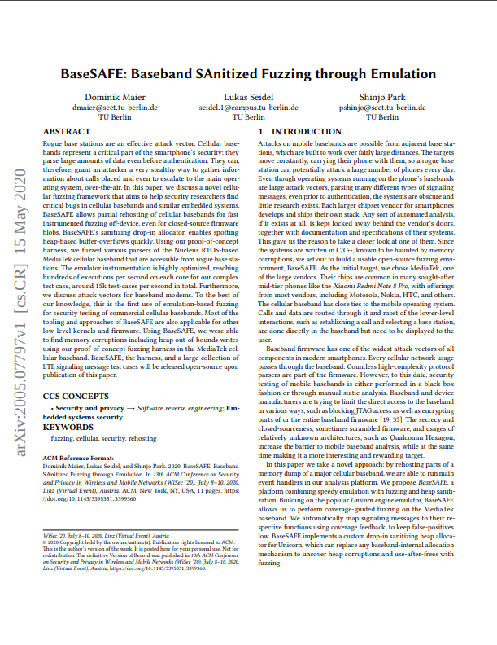

# BaseSAFE

<a href="https://arxiv.org/pdf/2005.07797.pdf"> </a>

This repository contains the BaseSAFE Rust APIs, introduced by "BaseSAFE: Baseband SAnitized Fuzzing through Emulation".

The _example/_ directory contains two harnesses emulating parts of the firmware for MediaTek’s Helio X10 (MT6795) baseband processor.
`_EMM_` demonstrates a crash inside the decoder for `ATTACH`/`ACCEPT` messages as part of the Mobility Management.
`_ERRC_` emulates various ASN.1 decoders which are being used for Radio Resource Control messages. Example inputs can be found inside the `_data/_` directories.

## Setup

```Make``` AFL++ and build _AFLplusplus/unicorn_mode_.

A single emulation run can be started by navigating into e.g.
_examples/errc_ and calling
```
cargo run data/pcch.raw
```

The emulated code can be fuzzed with [AFL++](https://github.com/AFLplusplus/AFLplusplus) in Unicorn mode:
```
cd examples/errc
cargo build --release
../../AFLplusplus/afl-fuzz -i in/ -o out/ -m none -- target/release/errc_fuzz @@
```